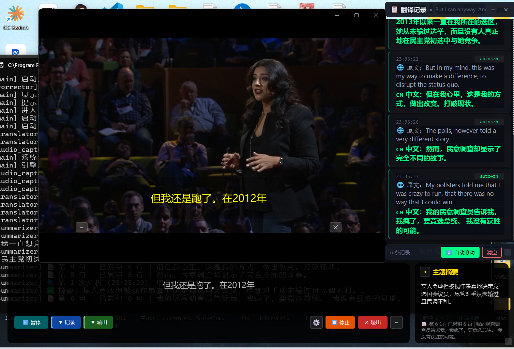

# 🎙️ AI LiveTranslate Pro

<h2 align="center">AI 同声翻译工具</h2>
<p align="center">
  实时捕获系统音频或麦克风语音，通过 AI 引擎双向翻译并生成字幕。<br>
  适用于<b>跨国会议、在线课程、外语直播</b>等场景，让语言不再成为沟通的障碍。
</p>

```bash
git clone https://github.com/lytssaa/AI-LiveTranslate-Pro.git
```

<p align="center">
  
  
  
  
</p>

---

## 📖 目录

- [✨ 创新亮点](#-创新亮点)
- [🧩 系统架构](#-系统架构)
- [🎯 功能特性](#-功能特性)
- [🚀 快速开始](#-快速开始)
- [⚙️ 配置详解](#️-配置详解)
- [🖥️ 界面说明](#️-界面说明)
- [🔧 技术栈](#-技术栈)
- [📐 项目结构](#-项目结构)
- [📝 PR 记录](#-pr-记录)
- [🎬 Demo 视频](#-demo-视频)
- [📄 许可证](#-许可证)

---

## ✨ 创新亮点

> **双引擎独立管线**：系统音频（Zoom 外方发言）→ 中文，麦克风（己方发言）→ 英文，两条管线独立运行互不干扰。接入 TTS 后即可实现**听 + 说双向同传**，覆盖国际会议全场景。

| 创新点 | 说明 |
|---|---|
| 🔄 双向实时翻译 | 双 Gummy 实例并行，系统音频+麦克风同时翻译，业界少见 |
| 🧠 AI 语义增强 | 摘要引擎 + 上下文纠错，不只是翻译，而是"理解"对话 |
| 🎛️ 全可视化控制 | 悬浮窗拖拽/缩放、右键自定义字号颜色、设置面板热配置 |
| 🔌 扩展就绪 | 预留 TTS 接口，接入即可实现语音播报，完成听→译→说闭环 |

---

## 🧩 系统架构

```
┌─────────────────────────────────────────────────────────┐
│                    AI LiveTranslate Pro                   │
├─────────────────────────────────────────────────────────┤
│                                                          │
│  ┌──────────┐   ┌──────────────┐   ┌─────────────────┐  │
│  │ 音频捕获  │──▶│ Gummy 翻译引擎 │──▶│  五路结果分发    │  │
│  │          │   │              │   │                 │  │
│  │ 系统音频  │   │ WS 实时翻译   │   │ ├─ 字幕悬浮窗    │  │
│  │ 麦克风   │   │ 双管线并行    │   │ ├─ 最终译文窗    │  │
│  └──────────┘   └──────────────┘   │ ├─ 摘要引擎      │  │
│                                     │ ├─ 纠错引擎      │  │
│                                     │ └─ 翻译面板      │  │
│                                     └─────────────────┘  │
│                                                          │
│  ┌──────────────────────────────────────────────────┐    │
│  │                Qt 事件循环主线程                     │    │
│  └──────────────────────────────────────────────────┘    │
└─────────────────────────────────────────────────────────┘
```

### 数据流

```
麦克风 ──▶ AudioCapture ──▶ GummyTranslator(mic) ──▶ 英文字幕
                                │
系统音频 ──▶ AudioCapture ──▶ GummyTranslator(sys) ──▶ 中文字幕
                                                         │
                                                    ┌────┴────┐
                                                    │ Summarizer │──▶ 会议纪要
                                                    │ Corrector  │──▶ 翻译纠错
                                                    └─────────┘
```

---

## 🎯 功能特性

- 🎤 **系统音频 / 麦克风** 实时捕获与翻译
- 🔄 **双向翻译模式** — 系统音频→中文 + 麦克风→英文，双管线并行
- 📝 **渐进累积式会议摘要** — LLM 自动生成结构化纪要
- 🔍 **上下文纠错引擎** — 翻译后语义修正，提升准确度
- 🪟 **悬浮字幕窗口** — 可拖拽、缩放，右键自定义背景/字号/颜色
- 📺 **最终译文窗口** — 独立大屏展示，适合投影/录制
- ⚙️ **可视化设置面板** — API / LLM / 音频参数一站式配置

---

## 🚀 快速开始

### 前置要求

- Python 3.11+
- Windows（WASAPI Loopback 依赖）
- 百炼 API Key（[免费获取](https://bailian.console.aliyun.com)）
- LLM API Key（DeepSeek 或百炼兼容接口，用于摘要 & 纠错）

### 安装

```bash
# 1. 克隆仓库
git clone https://github.com/lytssaa/AI-LiveTranslate-Pro.git
cd AI_LiveTranslate_Pro

# 2. 创建虚拟环境
python -m venv .venv
.venv\Scripts\activate      # Windows
# source .venv/bin/activate # macOS/Linux

# 3. 安装依赖
pip install -r requirements.txt

# 4. 配置 API 密钥
cp config.example.ini config.ini
# 编辑 config.ini，填入你的百炼 API Key 和 LLM API Key

# 5. 运行
python main.py
```

---

## ⚙️ 配置详解

编辑 `config.ini`（从 `config.example.ini` 复制）：

```ini
[api]
# 百炼 Gummy-Realtime-V1 WebSocket 翻译
api_key = sk-xxxxxxxxxxxxxxxx
api_url = wss://dashscope.aliyuncs.com/api-ws/v1/inference
gummy_model = gummy-realtime-v1

# LLM API（摘要 & 纠错，支持 OpenAI 兼容接口）
llm_api_key = sk-xxxxxxxxxxxxxxxx
llm_api_url = https://api.deepseek.com/v1/chat/completions
llm_model = deepseek-chat

[audio]
source = system              # system / mic
input_device = -1            # -1 = 默认设备

[translation]
source_language = auto
target_language = zh
max_end_silence = 800        # 断句静音阈值 (ms)

[features]
bidirectional_enabled = false
summary_interval = 60        # 摘要生成间隔 (秒)
```

### 环境变量（可选，优先级高于 config.ini）

| 环境变量 | 对应配置 |
|---|---|
| `DASHSCOPE_API_KEY` | `api_key` |
| `LLM_API_KEY` | `llm_api_key` |

---

## 🖥️ 界面说明

<p align="center">
  
</p>

启动后会出现三个窗口：

| 窗口 | 功能 | 操作 |
|---|---|---|
| **悬浮字幕窗** | 实时翻译结果 | 拖拽移动、缩放、右键菜单（字号/颜色/背景） |
| **最终译文窗** | 放大显示当前译文 | 右键自定义，适合投影展示 |
| **翻译面板** | 摘要/纠错日志 | 点击 ⚙ 打开设置 |

### 右键菜单

- 实时字幕：字号 10/14/22/32、背景色、字体色、恢复默认
- 最终译文：字号 12/18/24/32、背景色、透明度、字体色、恢复默认

---

## 🔧 技术栈

| 类别 | 技术 | 用途 |
|---|---|---|
| 框架 | PyQt6 | GUI 界面 |
| 音频 | PyAudioWPatch | WASAPI Loopback 系统音频捕获 |
| 翻译 | websocket-client | 百炼 Gummy-Realtime-V1 WebSocket 实时翻译 |
| AI | requests | LLM API 调用（摘要 & 纠错） |

> 以上为第三方依赖，`pip install -r requirements.txt` 一键安装。
> 核心业务逻辑（双管线翻译架构、摘要引擎、纠错引擎、UI 组件）均为原创实现。

---

## 📐 项目结构

```
AI_LiveTranslate_Pro/
├── main.py                  # 程序入口，主事件循环
├── config.example.ini       # 配置模板
├── requirements.txt         # Python 依赖
│
├── core/                    # 核心引擎
│   ├── translator.py        # Gummy WebSocket 翻译引擎（状态机）
│   ├── audio_capture.py     # WASAPI Loopback 音频捕获
│   ├── summarizer.py        # LLM 摘要引擎
│   └── corrector.py         # LLM 上下文纠错引擎
│
├── ui/                      # 用户界面
│   ├── subtitle_window.py   # 悬浮翻译字幕窗口
│   ├── final_subtitle.py    # 最终译文展示窗口
│   ├── transcript_panel.py  # 翻译记录 & 控制面板
│   └── settings_window.py   # 可视化设置面板
│
├── utils/                   # 工具模块
│   └── config.py            # 配置管理（三层优先级）
│
├── PR_DESCRIPTIONS.md       # PR 提交记录
└── README.md
```

---

## 📝 PR 记录

详见 [PR_DESCRIPTIONS.md](./PR_DESCRIPTIONS.md)，包含每个 PR 的标题、功能描述、实现思路和测试方式。

---

## 🎬 Demo 视频

[▶ 点击观看演示视频](demo.mp4)

## 📄 许可证

MIT License — 详见 [LICENSE](LICENSE) 文件。

---

<p align="center">
  <sub>Made with Python · Qt · 百炼 · DeepSeek</sub>
</p>
